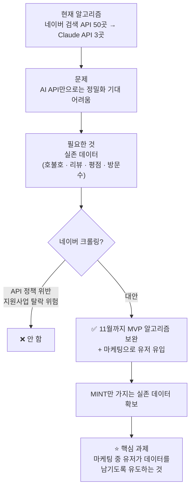
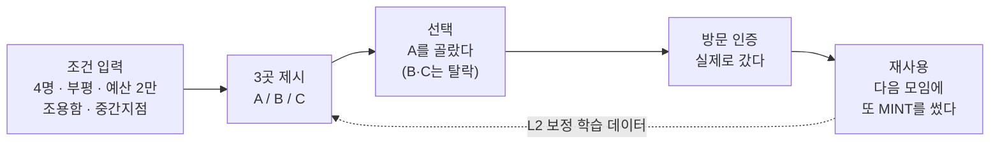

# 결정 로그

예시:

9/14 디자인 

디자인적 관점에서 배경색이 서비스에 맞지 않다고 생각하여
서비스의 기본 배경색을 #fffff에서 #adfced로 변경하였습니다.

배경색변경.png

---

9/14 백엔드

첫화면 진입시 ←홈 버튼을 눌러도 랜딩페이지로 탈출되지 않던 버그를 수정했습니다.

---

9/18일 첫 회의 이후 우연님 안건 제시

현재 알고리즘은 AI API로 장소추천 알고리즘의 정밀화가 기대되지 않는다 → 
실존 데이터 필요(기존 사용자들의 호불호 데이터;리뷰,평점,방문수등) → 
네이버 크롤링(실존데이터 사용)은 네이버 api정책 위반(지원사업 지원시 탈락 위험) → 
11월 까지 현재 MVP의 알고리즘을 최대한 보완 및 성장 시켜 마케팅을 통해 실제 유저들의 MINT만이 가지는 실존 데이터를 강구

따라서, 마케팅 중 유저들이 사용하면서 실존데이터를 남길수 있도록 유도하는것이 상당히 주요한 과제이다.

---

## 9/18 첫 회의 이후 · 우연님 안건 정리 (개발)

우연님이 제시해 주신 안건을 팀원분들이 한눈에 볼 수 있게 정리했습니다.

### 한 줄 요약

> AI API만으로는 추천이 더 정밀해지기 어렵다. 실존 데이터가 필요한데 네이버 크롤링은 못 하니까, **11월까지 마케팅으로 MINT만의 실존 데이터를 직접 쌓자.**
> 

### 논리 흐름

### 항목별 정리

| 항목 | 내용 |
| --- | --- |
| 지금 상태 | 네이버 검색 API로 실제 운영 중인 후보 50곳 → Claude API가 3곳으로 압축 |
| 문제 | AI API만으로는 추천의 정밀도가 더 올라가기 어렵다 |
| 필요한 것 | 실존 데이터 — 실제 사용자의 호불호(리뷰 · 평점 · 방문수 등) |
| 안 하는 것 | 네이버 크롤링 — 네이버 API 정책 위반이고, 지원사업 심사에서 탈락 위험 |
| 하는 것 | 11월까지 현재 MVP 알고리즘을 최대한 보완 · 성장시키고, 마케팅으로 실제 유저의 데이터를 확보 |
| 핵심 과제 | **마케팅 중 유저가 사용하면서 실존 데이터를 남기도록 유도하는 것** |

---

## 9/19 기획 · 우연님 안건에 대한 제 생각 정리 (김윤배)

우연님 말씀에 동의합니다. 크롤링은 안 하고, 11월까지 마케팅으로 MINT만의 실존 데이터를 쌓는다는 방향으로 가보고자 합니다. 다만 "실존 데이터"가 정확히 뭔지를 팀 전체가 같은 그림으로 봐야 마케팅도 개발도 안 흔들려서, 아래처럼 정리하고자 합니다.

### 1. 먼저 같이 생각해보고 싶은 점 — 리뷰·평점·방문수를 모으면 네이버 지도랑 뭐가 다를까요?

솔직히 크게 다르지 않을 것 같습니다. 유저한테 리뷰를 받고 별점을 매장 페이지에 붙이기 시작하면, 결국 "리뷰 100만 개 vs 300개"로 네이버랑 같은 게임을 하게 되는 건데, 그 게임은 이기기 어려울 거라고 봅니다. 그룹 단위라는 것만으로는 차별점이 약하다고 생각합니다.

그래서 **모으는 데이터의 종류 자체를 다르게 가져가면 어떨까 싶습니다.**

### 2. 네이버 데이터 vs MINT 데이터

| 구분 | 네이버 플레이스 | MINT |
| --- | --- | --- |
| 답하는 질문 | "이 가게 좋았어?" | "**이런 조건의 모임**에 이 가게가 맞았어?" |
| 누가 남기나 | 개인이, 자기 기준으로, 사후에 | 모임 리더가, 조건을 입력하고, 선택·방문하면서 |
| 네이버가 모르는 것 | 몇 명이서 왔는지 · 예산 · 왜 이 동네인지 · **다른 후보가 뭐였는지** | ← 이게 전부 우리 데이터 |
| 양으로 이길 수 있나 | 절대 못 이김 | 애초에 양으로 안 싸움 |

핵심은 세 번째 줄이라고 생각합니다. 네이버는 추천을 안 하니까 "뭘 제시했는데 뭘 골랐냐"는 데이터가 구조적으로 생길 수가 없고, 우리는 추천을 하니까 그게 자연스럽게 쌓여요.

### 3. MINT만 만들 수 있는 데이터 = 조건 → 선택 → 방문 → 재사용

이 네 단계가 **한 줄로 이어진 기록**이 우연님이 말씀하신 "MINT만이 가지는 실존 데이터"의 실체가 아닐까 싶습니다. 리뷰 텍스트보다 이 쌍(조건→결과)이 L2 알고리즘을 보정하는 데 훨씬 직접적인 학습 데이터가 될 거라고 봅니다.

### 4. 그래서 유저에게 보여주는 것도 조금 다르게 가면 어떨까 합니다

| 안 보여줄 것 (네이버 복사판) | 보여줄 것 (MINT만 가능) |
| --- | --- |
| ⭐ 4.3 | "비슷한 조건의 모임 **12팀**이 여기로 정했어요" |
| 리뷰 128개 | "4인 단체석 · 방문 인증 **8회**로 확인됨" |
| 방문자 리뷰 원문 | "이 예산대 모임 재선택률 **70%**" |

오른쪽 숫자들은 **조건이 같은 사람한테만 의미 있는 숫자**라 네이버가 따라 하기 어려울 거라고 생각합니다. 설계 원칙 3번(매장의 '말'이 아니라 사실·데이터만 신호)이랑도 잘 맞아서 이 방향으로 가보면 좋을 것 같습니다.

### 5. 정리 — 팀별로 부탁드리고 싶은 것

> 유저가 남겨주면 좋을 데이터는 **리뷰·별점보다 선택·방문·재사용**입니다.
> 

> 그래서 유도해야 할 건 "리뷰 써주세요"보다 **"어디로 정했어요?" 원탭 + 방문 인증** 쪽이 아닐까 싶습니다.
> 

| 담당 | 해주시면 좋을 것 | 시점 |
| --- | --- | --- |
| 개발 (우연님) | 추천 결과 화면에 "여기로 정했어요" 원탭 반응 1개 + 로그 저장 (recommendation_log에 선택 컬럼) — 가능 여부·소요 시간은 우연님 판단에 맡기겠습니다 | 기획 및 디자인 완료후 |
| 마케팅 | 유저 유도 메시지를 "리뷰 남겨주세요"보다 "어디로 정했는지 알려주세요" 쪽으로. 방문 인증 리워드와 연결하면 좋을 것 같습니다 | 마케팅 기획 단계부터 |
| 기획 및 디자인 | 결과 화면에 위 "보여줄 것" 3종 문구 설계, 방문 인증(R-05) 우선순위 상향 검토 | 기획 먼저 시작 |

### 6. 참고 — 그동안 정밀도는 어떻게 가져가면 좋을지 (크롤링 없이)

11월까지 데이터가 쌓이는 동안 L1 버블스코어는 사실상 안 돌아가는 상태일 겁니다. 급한 건 아니지만, 나중에 보정할 때 리뷰 신호가 필요해지면 크롤링 대신 쓸 수 있는 선택지를 미리 적어둡니다. 가능 여부랑 소요 시간은 우연님이 편하게 봐주시면 될 것 같습니다.

1. **네이버 블로그 검색 API** — 공식 API, 리뷰 텍스트가 오니까 협찬·체험단 키워드 비율 정도는 근사치 가능
2. **Google Places** — 평점·가격대·영업시간을 Claude 판단 재료로 (초기 무료 크레딧 범위)
3. **등록 매장 자체 데이터** — 12월 사업자 화면에서 사장님이 직접 입력한 단체석·예산을 '확인됨' 데이터로

이 세 개는 어디까지나 보조이고, 본체는 위 3번의 조건→선택→방문 데이터 — 즉 우리 유저가 남기는 기록이라고 생각합니다. 이에 대해 다른 의견 있으시면 편하게 말씀해 주세요.

### 7. 피그마 와이어프레임에 기획해 둗습니다

위 4번의 "보여줄 것"이 실제 화면에서 어떻게 보이는지, 그리고 데이터가 어느 화면에서 쌓이는지를 와이어프레임 **5행(to-be)**으로 그려 둗습니다. 한번 봐주시고 의견 주시면 감사하겠습니다.

🔗 [MINT Wireframe v0.1 → 5행 MINT 데이터 표시](https://www.figma.com/design/sr5b1uBOJPoLAEUKeV0nKf/?node-id=105-3)

| 화면 | 무엇을 보여주나 | 어떤 데이터가 쌓이나 |
| --- | --- | --- |
| **R-01b** 추천 결과 · MINT 데이터 카드 | 조건 배너 → 히어로 카드 안 민트 블록(비슷한 조건 12팀 선택 · 방문 인증 8회 확인 · 재선택률 70%) → "✓ 여기로 정했어요" 원탭. 별점·리뷰 수 없음 | 조건 → 선택 (탈락 후보 2개 포함) |
| **R-07** 선택 완료 시트 | "삼청옥으로 정했어요!" + 다음 팀에게 힌트가 된다는 한 줄 + 모임 날 방문 인증 500P 예고 | 선택 기록 확정, 인증 알림 예약 |
| **R-08** 방문 후 3초 피드백 | 인증 직후 "이 조건에 이 가게, 어떠었어요?" 3지선다(별점 아님). 안 맞았을 때만 이유 칩 | 방문 → 적합도 답 = L2 보정의 정답 라벨, 재사용 진입 |

각 화면 오른쪽 메모 카드에 구조 · 이동 · 데이터 · 메모를 적어 둗으니 개발·디자인 관점에서 걱리는 부분 있으면 거기 댓글로 남겨주셔도 됩니다. 이건 to-be 기획이라 12월 범위(RFP B·C)에 얼마나 넣을지는 우연님과 같이 정하면 좋겠습니다.

---

## 9/20 개발 · 진행 사항 정리 (우연)

윤배님 안건(조건→선택→방문 데이터 축적)에 동의하고, 그 앞에 붙어야 할 개발 작업을 정리했습니다. 오늘은 DB 재정비의 첫 단계와 버그 수정까지 했고, **아직 개발 서버(dev)에만 반영**되어 있습니다. 운영 반영은 별도 공지 후 진행합니다.

### 1. 결정 — DB 구조를 도메인별로 다시 만든다

지금 DB는 기획 단계에서 필요할 때마다 컬럼을 덧붙인 형태라 이해하기 어렵고, 후보 목록이 JSON 덩어리로 들어 있어 "어떤 조건에서 어떤 가게가 선택됐나"를 조회할 수 없습니다. 우선순위 P0(계정·데이터 서버화)와 윤배님 안건(선택·방문 데이터)이 둘 다 이 위에 올라가야 해서, 새로 짓기로 했습니다.

- 한 번에 다 바꾸지 않고 **사용자 → 추천·선택 → 모임 → 피드백** 순서로 도메인별 교체
- 기존 테이블은 새 테이블이 검증될 때까지 남겨 두고 나중에 삭제
- 모든 테이블·컬럼에 한글 설명을 붙이고, JSON 컬럼은 쓰지 않음
- 트래픽이 적은 지금이 가장 싼 시점이고, 11월 마케팅 후에는 이 작업이 몇 배 비싸짐

### 2. 오늘 완료 — 사용자 테이블과 로그인 구조 (dev)

**윤배님 정책("로그인을 강제하지 않는다. 필수는 쿠폰 교환뿐")을 그대로 따르면서** 구조를 단순하게 만드는 방식으로 갔습니다.

| 항목 | 내용 |
|---|---|
| 새 테이블 `users` | 기존 `mint_profiles` 대체. 카카오 UID, 닉네임, 프로필 이미지, 가입일, 최근 로그인 |
| 비회원 처리 | 앱(/app)에 들어오면 자동으로 **익명 사용자**가 됨. 사용자는 아무것도 느끼지 않음 |
| 회원 처리 | 카카오 로그인하면 회원 사용자로 전환. 기존 회원이 새 폰에서 로그인해도 같은 계정으로 이어짐 |
| 회원/비회원 구분 | 카카오 UID가 있으면 회원 |

**팀에서 알아두실 것 — 비회원 데이터는 그 기기에만 남습니다.** 폰을 바꾸거나 브라우저 데이터를 지우면 사라집니다. 이건 어떤 기술로도 로그인 없이는 못 막습니다. 그래서 로그인은 "강제"가 아니라 **"데이터를 지키는 복구 수단"**으로 안내하는 게 맞습니다. 예: 포인트가 처음 쌓인 직후 "폰 바꿔도 지키려면 카카오 연결" 한 번 권유. 기획·마케팅 문구에 반영 부탁드립니다.

### 3. 오늘 발견·수정한 버그 (dev)

- **카카오 공유가 4월부터 카드 형태로 나간 적이 없었습니다.** SDK 주소가 잘못돼 있어(카카오 측 경로와 다름) 로드가 실패했고, 그때마다 OS 공유 시트(텍스트+링크)로 대체됐습니다. 공유 자체는 됐기 때문에 눈에 안 띄었습니다. 주소 수정 + 초기화 순서 수정으로 카카오톡 카드 공유가 살아났습니다. 휴대폰에서 확인 완료.
- 오프라인 캐시 처리(서비스워커)가 외부 스크립트 실패 시 에러를 내던 문제 수정.
- 익명 사용자 도입으로 이벤트 기록이 막히던 문제 수정(DB 권한 정책 변경).

### 4. 알고리즘 — 윤배님 안건에 한 단계 추가 제안

안건의 전제("AI API로는 정밀화가 어렵다 → 실존 데이터 필요")에 동의하는데, 코드를 확인해 보니 **지금 부정확한 이유의 절반은 데이터 부족이 아니라 사용자가 고른 조건이 실제 필터에 닿지 않는 구조**입니다.

| 사용자 선택 | 실제로 어디까지 가나 |
|---|---|
| 지역·거리, 재추천 제외 | 데이터로 확실히 걸러짐 |
| 못 먹는 음식 | 가게 이름·업종에 단어가 있을 때만 걸러짐 |
| 목적·메뉴·인원·관계·특별한 날 | 검색어에만 들어감. 보장 없음 |
| **분위기, 예산 중간 구간, 조건 4개째부터** | **AI에게 문장으로만 전달** |

그리고 결과 카드의 가격대·분위기 태그는 AI가 가게 이름만 보고 만든 추정값인데 화면에서는 확인된 정보처럼 보입니다.

그래서 개발 항목을 셋으로 나누자고 제안합니다.

1. **지금 고칠 것 (데이터 불필요)** — 사용자 조건이 필터에 닿게. 목적·못 먹는 음식은 업종 데이터로 하드 필터, 폐업 가게 제외(공공데이터에 이미 있음), 조건 칩 전부 검색 반영. AI 추정값(가격대·분위기)은 "추정" 표기 또는 비노출. **마케팅 전에 끝나야 함** — 첫 추천에서 "새우 못 먹는다 했는데 새우집"이 나오면 유저는 데이터를 남기기 전에 나갑니다.
2. **수집 배관** — "여기로 정했어요" 원탭, 방문 인증을 추천 기록에 연결. 윤배님 요청 사항. 관련 컬럼과 식별자가 이미 있어 UI 포함 1~2일.
3. **데이터가 쌓여야 좋아지는 것** — 무드·예산 정확도, "비슷한 조건 N팀" 표시. 윤배님 안 그대로.

장기적으로는 **AI가 최종 결정하는 구조를 바꿀 계획**입니다. 데이터로 계산 가능한 점수는 코드가 매기고, AI는 "왜 이 조건에 맞는지" 설명만 맡깁니다. 그래야 "왜 이 집이 나왔나"를 설명할 수 있고, 쌓이는 선택·방문 데이터로 가중치를 고칠 수 있습니다. 새 DB 구조도 이걸 전제로 설계합니다.

보조 데이터 선택지 중 **Google Places는 보류**를 권합니다. 약관상 구글 외 지도(우리는 카카오맵)에 그 데이터를 표시하면 위반이라, 크롤링을 뺀 것과 같은 잣대로 보면 같이 빼는 게 맞습니다. 블로그 API와 사장님 직접 입력은 문제없습니다.

### 5. 다음 단계

| 순서 | 작업 | 비고 |
|---|---|---|
| 1 | 사용자 테이블 운영 반영 | SQL 실행 + 배포. 반영 전 공지 |
| 2 | 추천·선택 테이블 신설 | 조건 전부 + 후보 전부 + 점수 내역이 조회 가능한 구조 |
| 3 | "여기로 정했어요" 원탭 + 방문 인증 연결 | 기획·디자인 나오는 대로 |
| 4 | 조건이 필터에 닿게 하기 (4-1번) | 마케팅 전 목표 |

기획·디자인 쪽에 부탁드릴 것: R-01b·R-07·R-08 와이어프레임에 **"데이터가 아직 없을 때"** 화면이 필요합니다. "비슷한 조건 12팀"은 몇 달간 0~1로 뜰 텐데, 그때 숨길지 "첫 팀이 되어 주세요"로 보여줄지 정해 주시면 좋겠습니다.

---